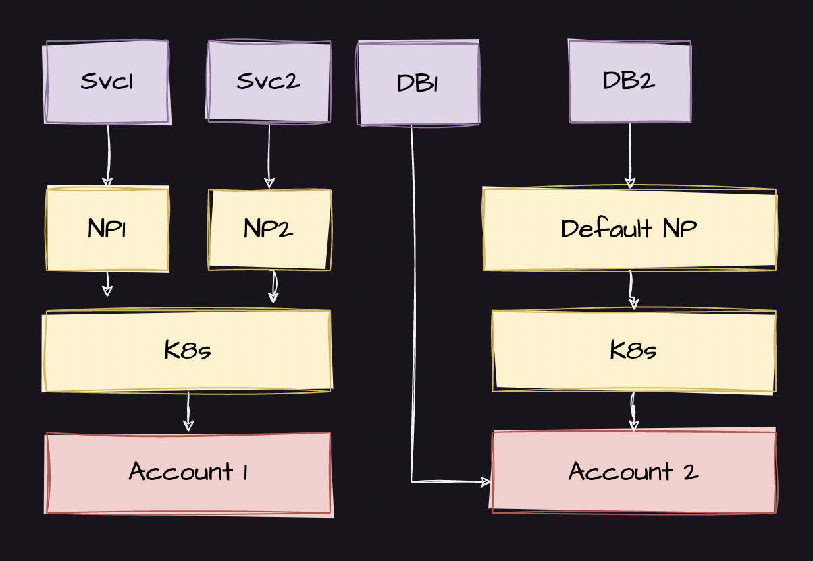

# Infrastructure as Catalog (InCa)

## Introduction

Welcome to **Infrastructure as Catalog (InCa)**, an open-source initiative that redefines infrastructure management
through abstraction and declarative definitions. By allowing users to define their infrastructure needs at a high level,
using a catalog, the intricate details of infrastructure setup and maintenance are abstracted away. This not only
streamlines the process but also ensures a more flexible and scalable infrastructure management approach.

## Why InCa?

Traditional infrastructure management is often mired in manual processes, scripts, and configurations that are tightly
bound to specific technologies or platforms. Such an approach can lead to:

- **Inflexibility**: Modifying a part of the infrastructure or transitioning to a new platform becomes a monumental
  task.
- **Complexity**: As the infrastructure expands, its management becomes increasingly convoluted, leading to potential
  errors and inefficiencies.
- **Limited Scalability**: Configurations and scripts that are closely intertwined might not scale efficiently with
  burgeoning infrastructure demands.

**InCa** addresses these challenges:

- **Documenting Architecture**: This approach inherently documents the entire infrastructure architecture in one
  centralized location, ensuring clarity, transparency, and ease of reference.
- **Promoting Platform Engineering**: Different resource types can be owned and managed by distinct personas or teams.
  This clear delineation promotes responsibility and expertise in platform engineering.
- **Promoting Abstraction**: By focusing on the desired outcome (e.g., a MySQL database or a compute instance) rather
  than its implementation, users can effortlessly switch between different implementations (flavors) without altering
  the overarching definitions.
- **Boosting Flexibility**: Want to transition from an on-premises MySQL database to one based in the cloud? Simply
  modify the flavor in your catalog, leaving the core definition untouched.
- **Streamlining Management**: With each resource defined individually, the system becomes modular, facilitating easier
  management, versioning, and collaboration.

## Why is IaC not enough?

Infrastructure as Code (IaC) has been a game-changer for many organizations, allowing them to automate and manage their
infrastructure using code. However, it's not without its challenges:

- **Lack of Expertise**: Properly implementing IaC requires a deep understanding of both the infrastructure components
  and the scripting or coding involved. Not every organization has this expertise in-house, leading to suboptimal
  implementations.
- **Poor Coding Practices**: Just like any other codebase, IaC can suffer from bad coding practices, leading to
  inefficiencies, vulnerabilities, and maintenance nightmares.
- **Modularization Issues**: Often, organizations struggle to modularize their IaC properly. This results in tightly
  coupled configurations that are hard to manage, update, or scale.

**InCa** offers a solution to these challenges by abstracting the complexities and providing a more structured, modular,
and intuitive approach to defining infrastructure.

### How to imagine a product infrastructure as a catalog.

When we dissect the process of infrastructure creation for any product, it's typically built in distinct layers.

Initially, we often begin with a cloud provider account. In constructing an architecture for a product, there might be
one or multiple accounts involved. The need for separate accounts can arise from factors like distinct billing
requirements or specific compliance mandates.

Next, we lay down the foundational networking layer. In this phase, decisions about VPCs, subnets, security groups, and
other related elements are made, aligning with both the organizational standards and the specifications of the selected
cloud provider.

Building upon this is the orchestration layer, commonly embodied by systems like Kubernetes. This layer is predominantly
set up by platform teams and serves as a catalyst for application teams. It offers them a conducive environment to host
their applications.

At the pinnacle, we have resources, which are the essential building blocks of any architectural design. This category
includes components such as services, databases, caches, and the like.

While this list provides a structured overview, it's not exhaustive. However, it offers a foundational sample to aid in
visualizing our catalog.

## Contribute

Being an open-source project, Infrastructure as Catalog (InCa) thrives on community contributions. Whether you're
enhancing the existing FacetsCore implementation, introducing a new flavor, improving documentation, or reporting bugs,
your input is invaluable. Dive into our [GUIDELINES.md](GUIDELINES.md) for guidelines on how to be a part of this
project.

By documenting the architecture and promoting platform engineering, Infrastructure as Catalog (InCa) fosters
responsibility and expertise, ensuring efficient infrastructure management. Join us in redefining the future of
infrastructure!
